# Mermaid Class Diagram Skill

Spezialisierter Skill fuer Mermaid Class-Diagramme. Class Diagrams visualisieren Klassen-Strukturen, Beziehungen und OOP-Modelle.

## Grundlagen

### Basis-Syntax
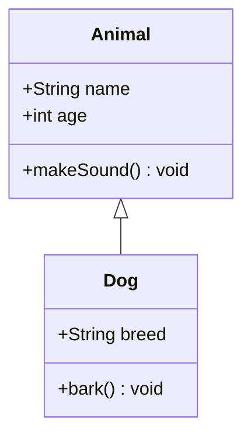

## Klassen definieren

### Einfache Klasse
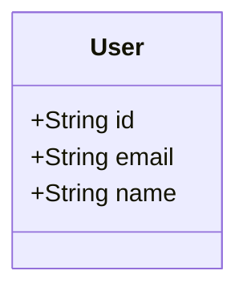

### Klasse mit Sichtbarkeit
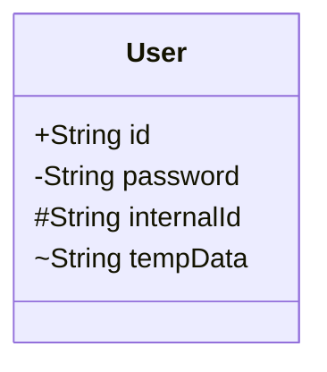

### Sichtbarkeits-Modifikatoren
- `+` - Public
- `-` - Private
- `#` - Protected
- `~` - Package/Internal

### Klasse mit Methoden
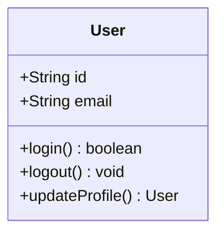

### Interface/Abstract Class
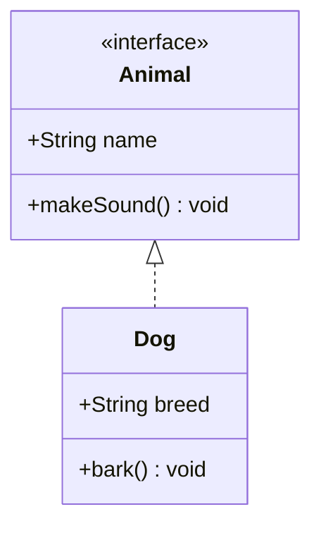

## Beziehungen

### Vererbung (Inheritance)
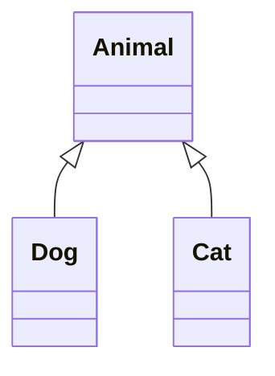

### Realisierung (Implementation)
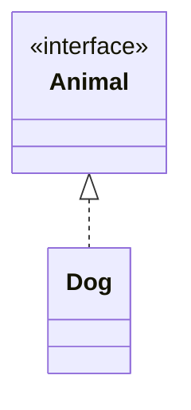

### Komposition (Composition)
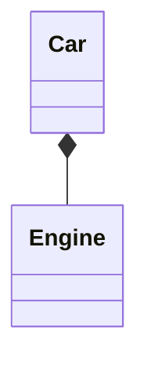

### Aggregation (Aggregation)
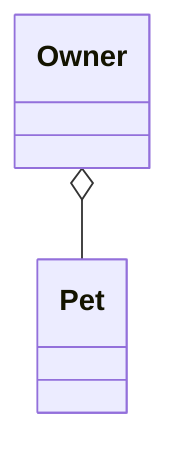

### Assoziation (Association)
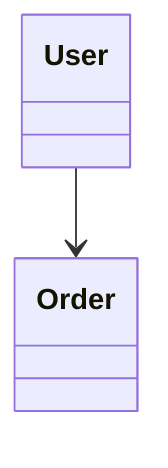

### Dependency (Dependency)
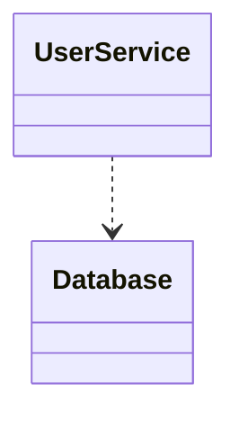

### Kardinalitaeten
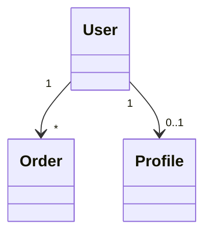

## Vollstaendiges Beispiel

### E-Commerce Domain Model
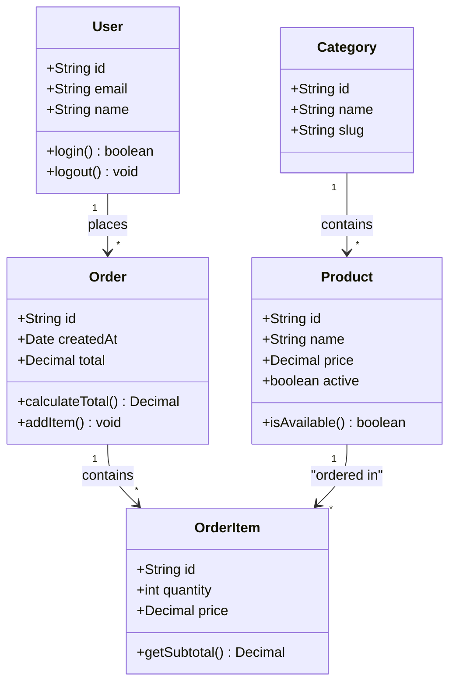

## Clevermation Templates

### Supabase Client Structure
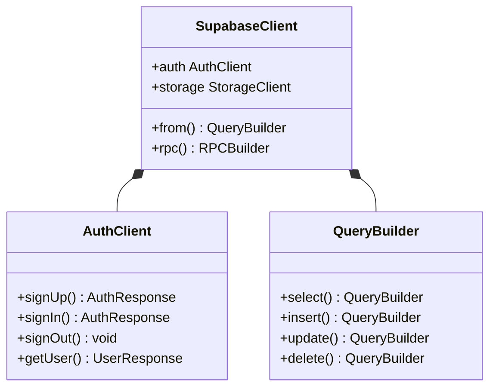

### N8N Workflow Structure
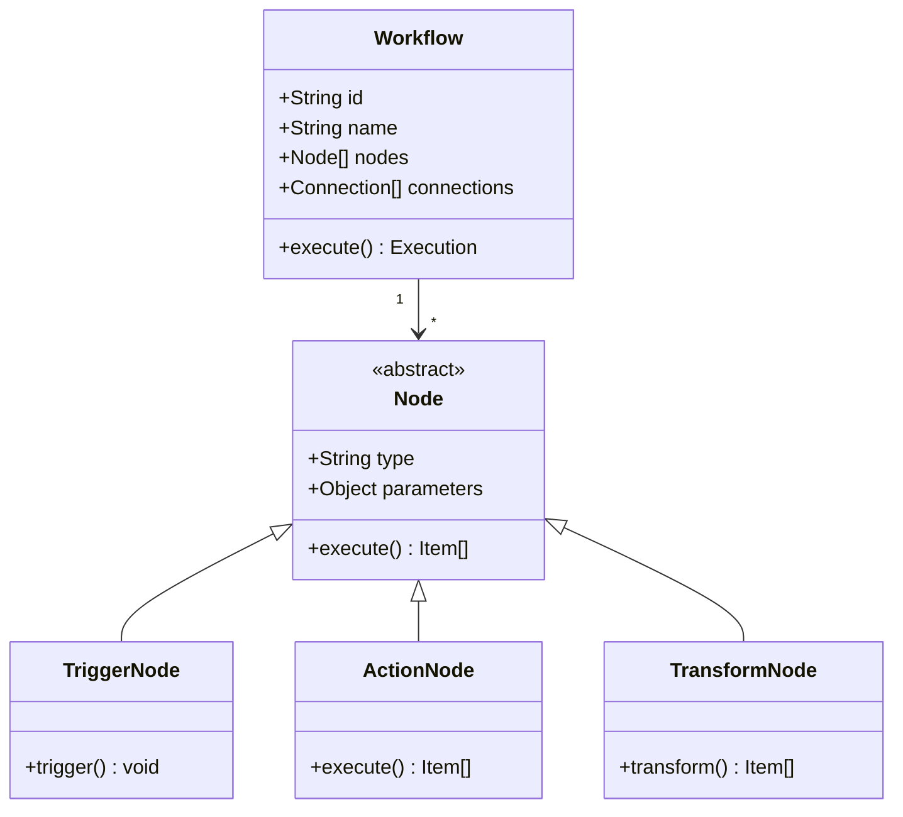

## Best Practices

### 1. Klare Struktur
- Klassen mit aussagekraeftigen Namen
- Sichtbarkeit korrekt setzen
- Methoden und Attribute vollstaendig

### 2. Beziehungen richtig darstellen
- Vererbung: `<|--`
- Komposition: `*--` (starke Beziehung)
- Aggregation: `o--` (schwache Beziehung)
- Dependency: `..>` (nutzt, aber besitzt nicht)

### 3. Kardinalitaeten angeben
- `"1"` - Genau eins
- `"*"` - Viele
- `"0..1"` - Null oder eins
- `"1..*"` - Eins oder mehr

### 4. Interfaces/Abstract Classes
- Mit `<<interface>>` oder `<<abstract>>` markieren
- Realisierung mit `<|..` zeigen

## Verwendung im Plan Agent

Wenn der Plan Agent ein Class Diagram erstellen soll:
1. Identifiziere alle Klassen/Interfaces
2. Definiere Attribute und Methoden
3. Bestimme Beziehungen zwischen Klassen
4. Setze Kardinalitaeten
5. Erstelle das Diagramm mit diesem Skill

**Wichtig:** Nutze diesen Skill NUR fuer Class Diagrams. Fuer andere Diagrammtypen verwende die entsprechenden Skills (flowchart, sequence, er, etc.).

