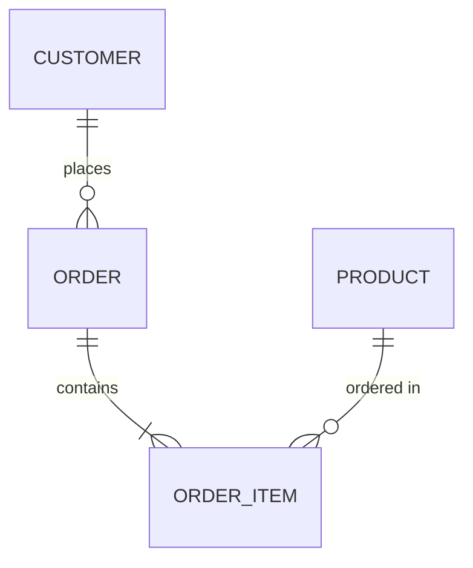
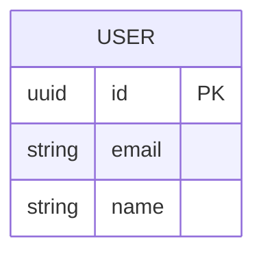
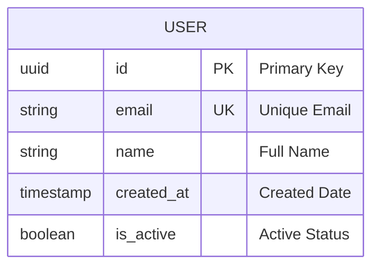
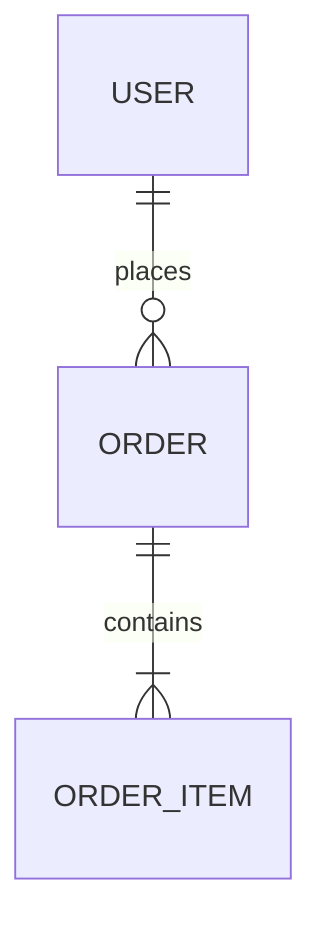
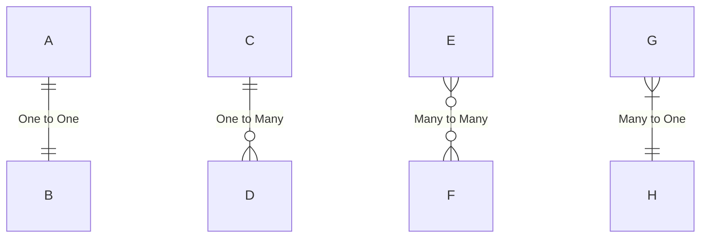
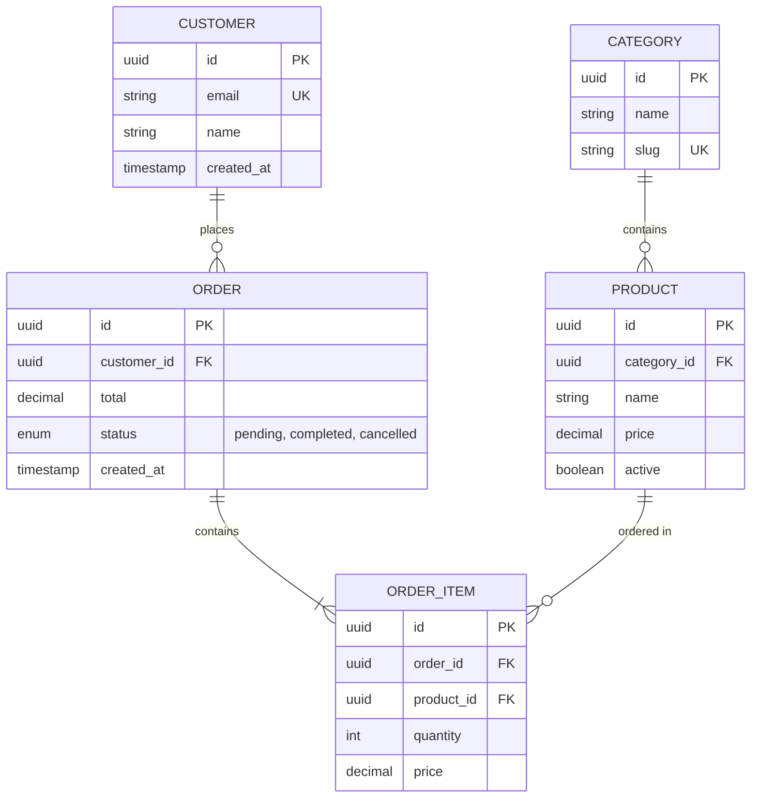
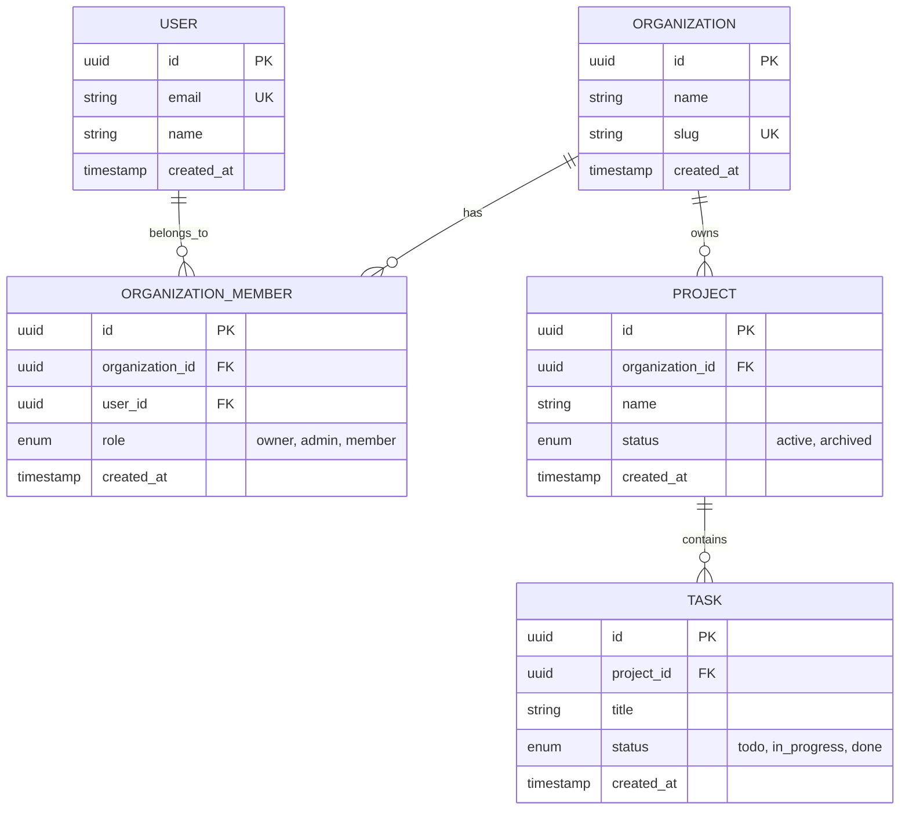
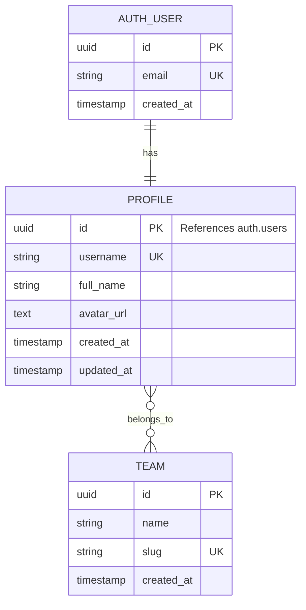

# Mermaid ER Diagram Skill

Spezialisierter Skill fuer Mermaid Entity Relationship (ER) Diagramme. ER-Diagramme visualisieren Datenbank-Schemas und Beziehungen zwischen Entitaeten.

## Grundlagen

### Basis-Syntax

## Entitaeten definieren

### Einfache Entitaet

### Vollstaendige Entitaet mit allen Details

## Beziehungen (Relationships)

### Kardinalitaeten

### Kardinalitaets-Notation
- `||` - Exactly one (1)
- `|o` - Zero or one (0..1)
- `}o` - Zero or more (0..*)
- `}|` - One or more (1..*)

### Beziehungs-Typen

## Vollstaendiges Beispiel

### E-Commerce Schema

## Clevermation Templates

### Supabase Multi-Tenant Schema

### User Profile Extension

## Best Practices

### 1. Klare Namenskonventionen
- Tabellen: Plural, snake_case (`users`, `order_items`)
- Spalten: snake_case (`user_id`, `created_at`)
- Primary Keys: immer `id`
- Foreign Keys: `tabelle_id`

### 2. Vollstaendige Definitionen
- Alle wichtigen Spalten definieren
- Datentypen angeben (uuid, string, timestamp, etc.)
- Constraints markieren (PK, UK, FK)

### 3. Beziehungen klar darstellen
- Kardinalitaeten korrekt setzen
- Beziehungsnamen aussagekraeftig
- Richtung der Beziehung beachten

### 4. Komplexitaet managen
- Bei vielen Tabellen: Aufteilen in mehrere Diagramme
- Wichtige Beziehungen hervorheben
- Unwichtige Details weglassen

## Verwendung im Plan Agent

Wenn der Plan Agent ein ER-Diagramm erstellen soll:
1. Analysiere das Datenmodell/Schema
2. Identifiziere alle Entitaeten (Tabellen)
3. Definiere Attribute (Spalten) pro Entitaet
4. Bestimme Beziehungen und Kardinalitaeten
5. Erstelle das Diagramm mit diesem Skill

**Wichtig:** Nutze diesen Skill NUR fuer ER-Diagramme. Fuer andere Diagrammtypen verwende die entsprechenden Skills (flowchart, sequence, gantt, etc.).

