# Mermaid Flowchart Skill

Spezialisierter Skill fuer Mermaid Flowchart-Diagramme. Flowcharts visualisieren Prozessablaeufe, Entscheidungslogik und Workflows.

## Grundlagen

### Basis-Syntax
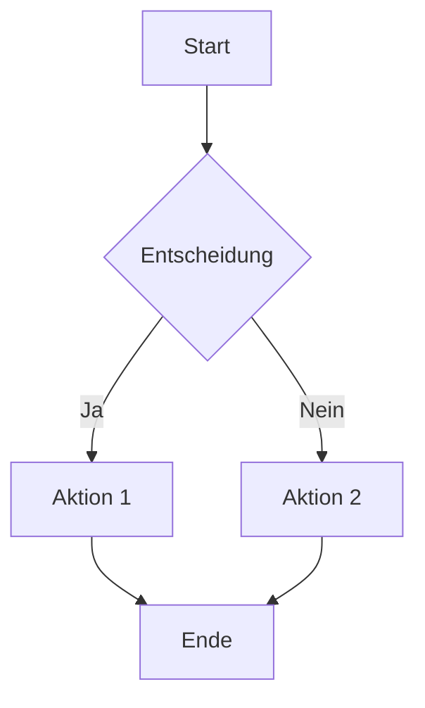

### Richtungen
- `TD` - Top Down (oben nach unten) - Standard
- `LR` - Left Right (links nach rechts)
- `BT` - Bottom Top (unten nach oben)
- `RL` - Right Left (rechts nach links)

## Knoten-Formen

### Standard-Formen
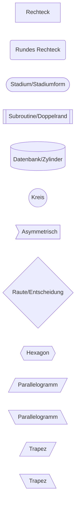

### Formen-Referenz
- `[Text]` - Rechteck (Standard)
- `(Text)` - Abgerundetes Rechteck
- `([Text])` - Stadium-Form
- `[[Text]]` - Subroutine (Doppelrand)
- `[(Text)]` - Datenbank/Zylinder
- `((Text))` - Kreis
- `>Text]` - Asymmetrisch
- `{Text}` - Raute/Entscheidung
- `{{Text}}` - Hexagon
- `/Text/` - Parallelogramm rechts
- `\Text\` - Parallelogramm links
- `/Text/` - Trapez rechts
- `\Text\` - Trapez links

## Verbindungen

### Pfeil-Typen
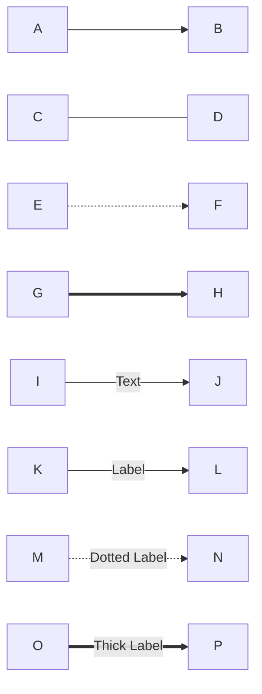

- `-->` - Solid mit Pfeil
- `---` - Solid ohne Pfeil
- `-.->` - Dotted mit Pfeil
- `==>` - Thick mit Pfeil
- `--Text-->` - Mit Text-Label
- `-->|Label|` - Mit Label auf Pfeil

### Mehrfach-Verbindungen
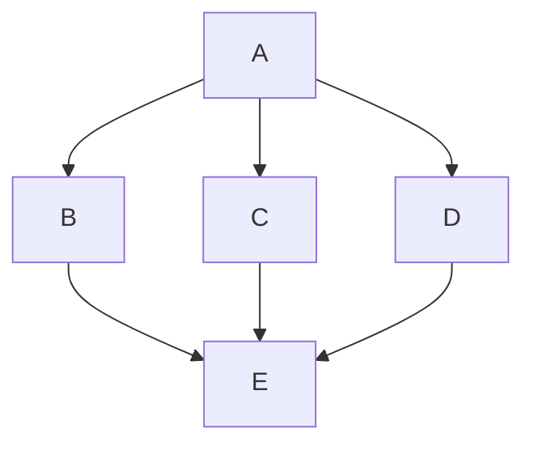

## Subgraphs (Gruppierung)

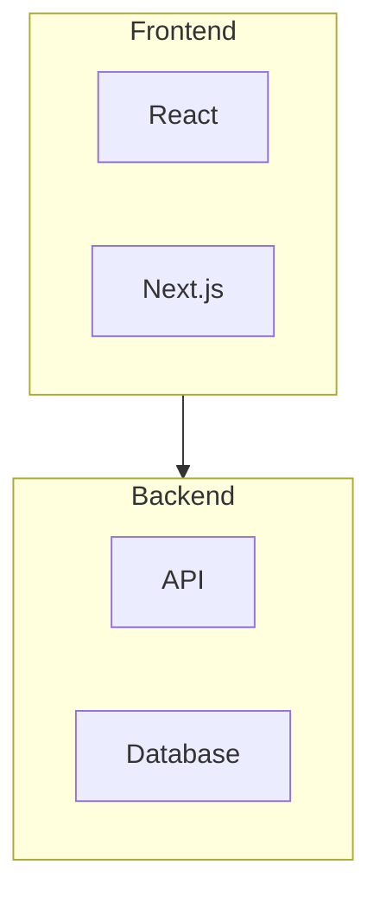

### Subgraph mit Richtung
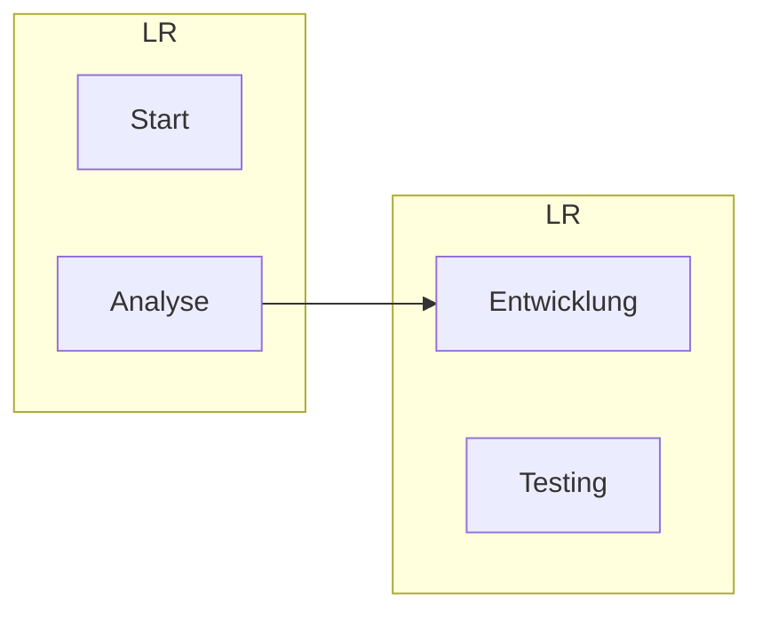

## Styling

### Klassen-basiertes Styling
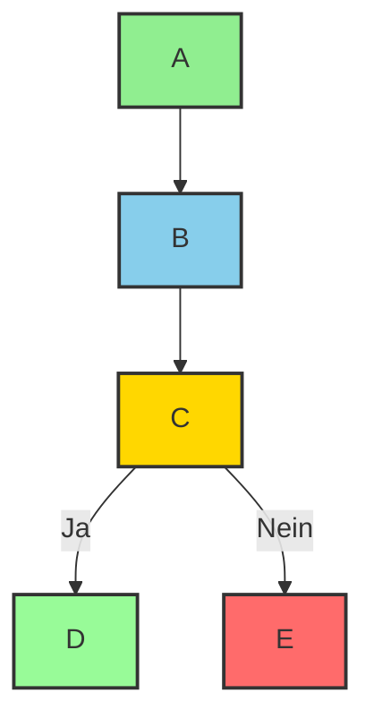

### Inline-Styling
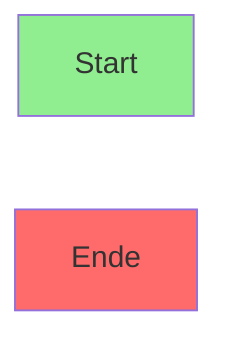

### Individuelle Knoten-Styles
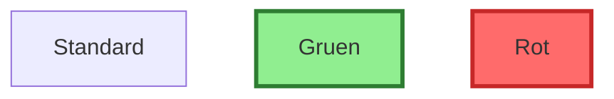

## Clevermation Templates

### N8N Workflow Visualisierung
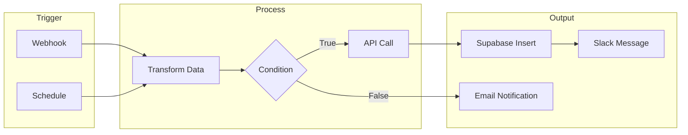

### Power Automate Integration Flow
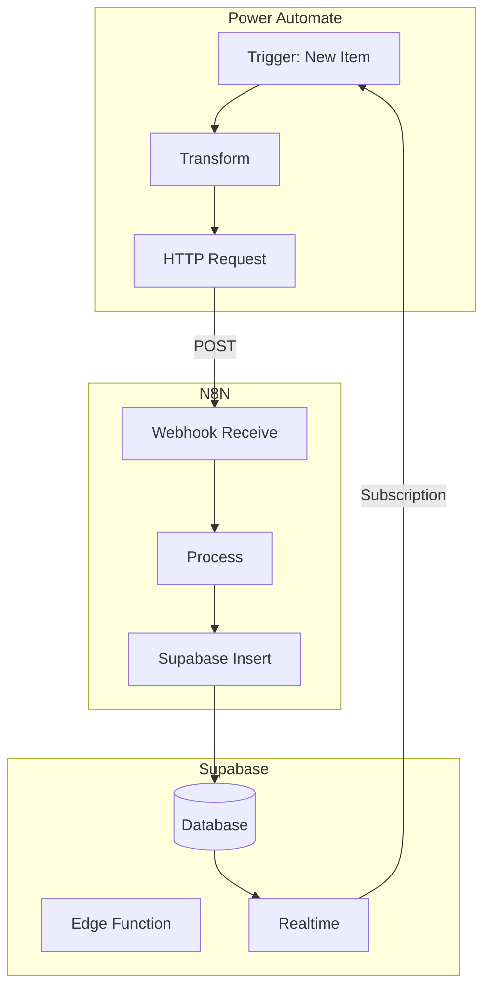

### Login Flow
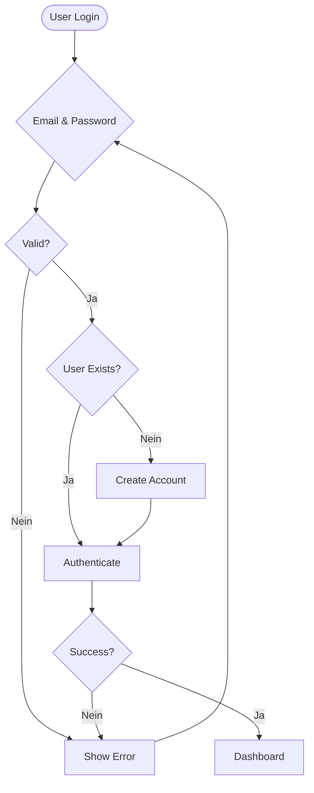

## Best Practices

### 1. Klare Struktur
- Maximal 15-20 Knoten pro Diagramm
- Logische Gruppierung mit Subgraphs
- Konsistente Richtung (TD oder LR)

### 2. Lesbarkeit
- Kurze, klare Labels
- Entscheidungsknoten immer als Raute `{}`
- Start/Ende als Stadium `([ ])`

### 3. Farben sinnvoll einsetzen
- Gruen: Start/Erfolg
- Rot: Fehler/Ende
- Blau: Prozess-Schritte
- Gelb: Entscheidungen

### 4. Komplexitaet reduzieren
- Bei zu vielen Knoten: Aufteilen in mehrere Diagramme
- Wichtige Details hervorheben
- Unwichtige Schritte weglassen

## Verwendung im Plan Agent

Wenn der Plan Agent ein Flowchart erstellen soll:
1. Analysiere den Prozess/Workflow
2. Identifiziere Start- und Endpunkte
3. Markiere Entscheidungspunkte
4. Definiere Hauptschritte
5. Erstelle das Diagramm mit diesem Skill

**Wichtig:** Nutze diesen Skill NUR fuer Flowcharts. Fuer andere Diagrammtypen verwende die entsprechenden Skills (sequence, er, gantt, etc.).

