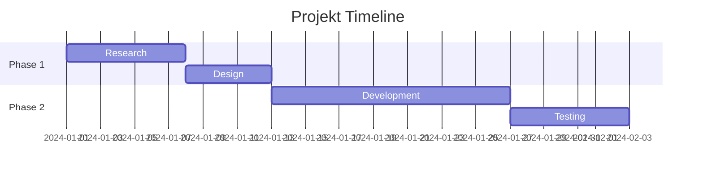
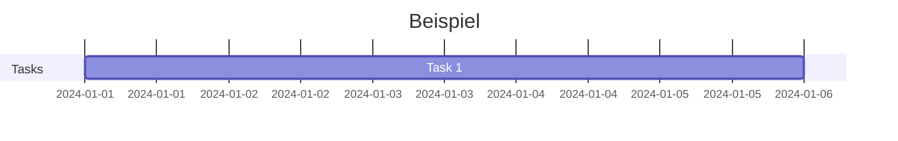
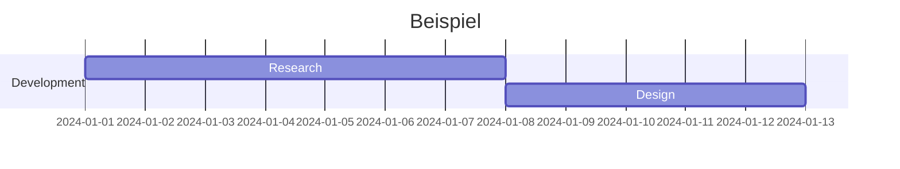
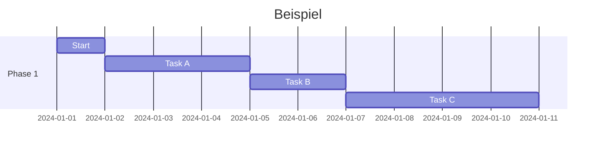
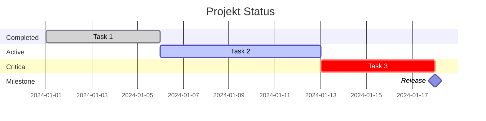
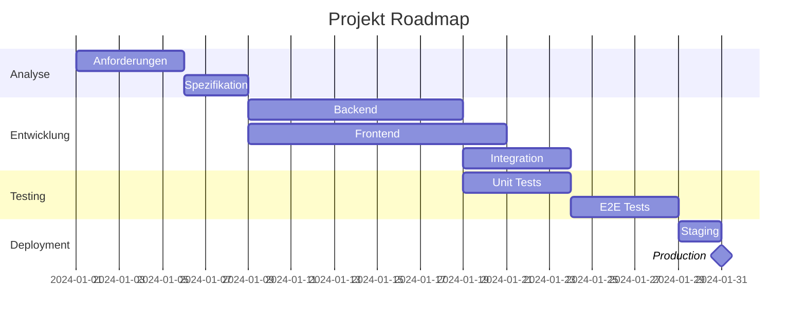
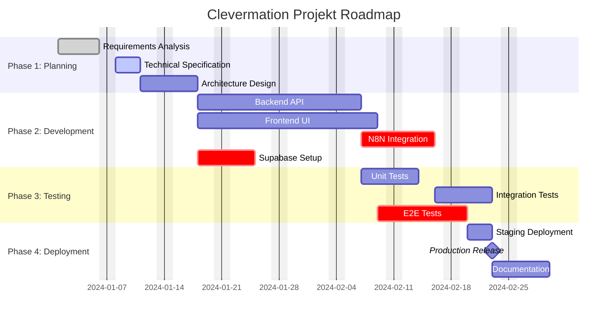
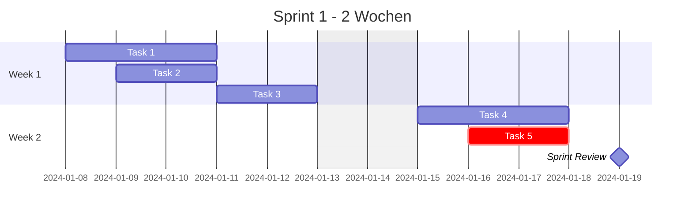

# Mermaid Gantt Chart Skill

Spezialisierter Skill fuer Mermaid Gantt-Diagramme. Gantt Charts visualisieren Projekt-Timelines, Aufgaben und Meilensteine.

## Grundlagen

### Basis-Syntax


## Datum-Format

### Standard-Formate
```mermaid
gantt
    dateFormat YYYY-MM-DD
    title Beispiel
```

### Verfuegbare Formate
- `YYYY-MM-DD` - 2024-01-15 (Standard)
- `MM/DD/YYYY` - 01/15/2024
- `DD-MM-YYYY` - 15-01-2024
- `YYYY-MM-DD HH:mm` - Mit Zeit

## Aufgaben definieren

### Einfache Aufgabe


### Aufgabe mit ID und Label


### Relative Daten


## Task-Marker

### Status-Marker


### Marker-Typen
- `done` - Aufgabe abgeschlossen (gruen)
- `active` - Aufgabe in Bearbeitung (blau)
- `crit` - Kritischer Pfad (rot)
- `milestone` - Meilenstein (Diamant)

## Sections (Phasen)

### Mehrere Sections


## Excludes (Ausnahmen)

### Wochenenden ausschliessen
```mermaid
gantt
    dateFormat YYYY-MM-DD
    excludes weekends
    title Beispiel
```

### Spezifische Tage ausschliessen
```mermaid
gantt
    dateFormat YYYY-MM-DD
    excludes 2024-01-01,2024-12-25
    title Beispiel
```

### Wochentage ausschliessen
```mermaid
gantt
    dateFormat YYYY-MM-DD
    excludes weekends
    excludes 2024-01-01
    title Beispiel
```

## Clevermation Templates

### Projekt-Roadmap


### Sprint-Planung


## Best Practices

### 1. Klare Struktur
- Sections fuer logische Gruppierung
- Aufgaben mit aussagekraeftigen Namen
- IDs fuer Referenzen verwenden

### 2. Realistische Zeitplaene
- Pufferzeiten einplanen
- Abhaengigkeiten beachten
- Kritische Pfade markieren

### 3. Status-Tracking
- `done` fuer abgeschlossene Aufgaben
- `active` fuer laufende Aufgaben
- `crit` fuer kritische Aufgaben

### 4. Meilensteine
- Wichtige Events als Milestones
- Release-Daten markieren
- Review-Termine hervorheben

## Verwendung im Plan Agent

Wenn der Plan Agent ein Gantt-Diagramm erstellen soll:
1. Definiere Projekt-Phasen (Sections)
2. Liste alle Aufgaben auf
3. Setze Startdaten und Dauer
4. Definiere Abhaengigkeiten (`after`)
5. Markiere Status und kritische Aufgaben
6. Erstelle das Diagramm mit diesem Skill

**Wichtig:** Nutze diesen Skill NUR fuer Gantt-Diagramme. Fuer andere Diagrammtypen verwende die entsprechenden Skills (flowchart, sequence, er, etc.).

