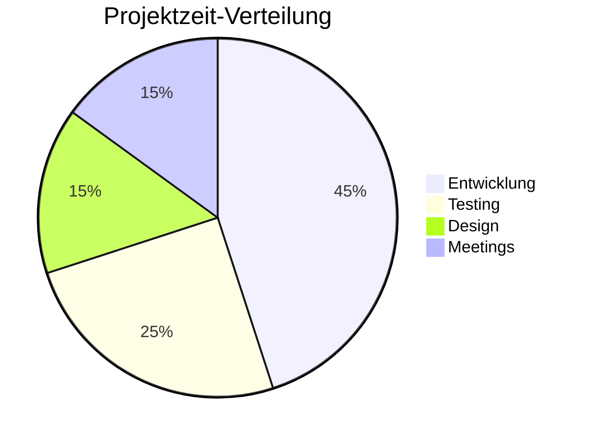
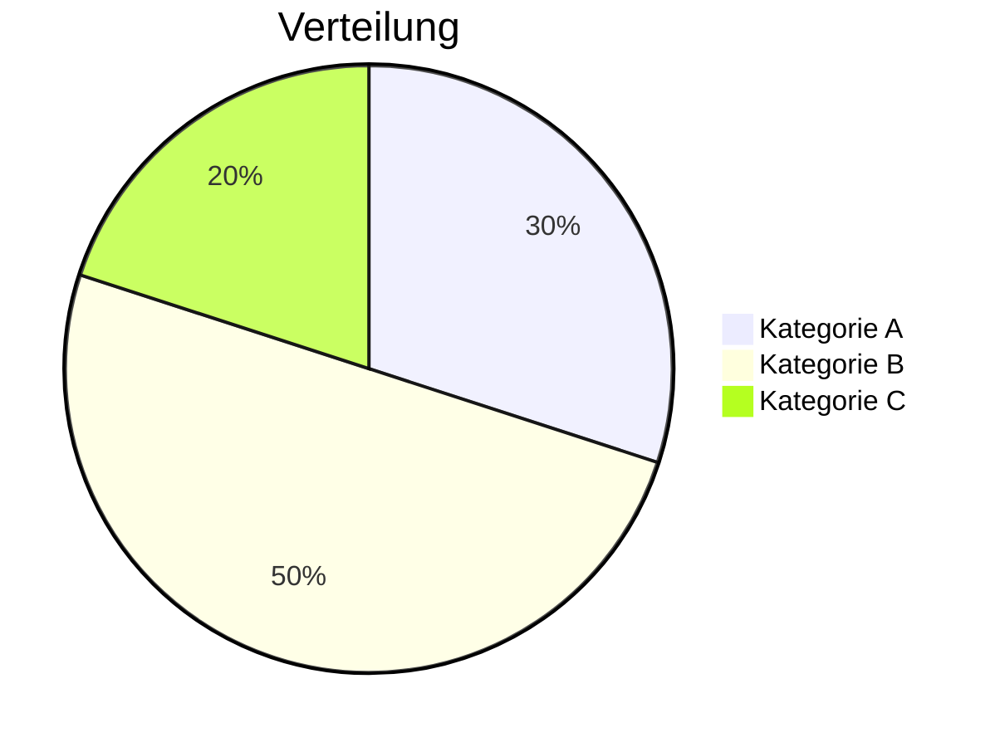
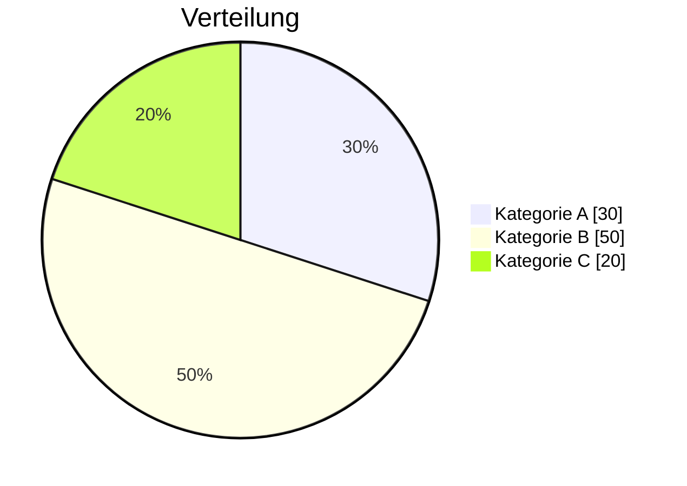
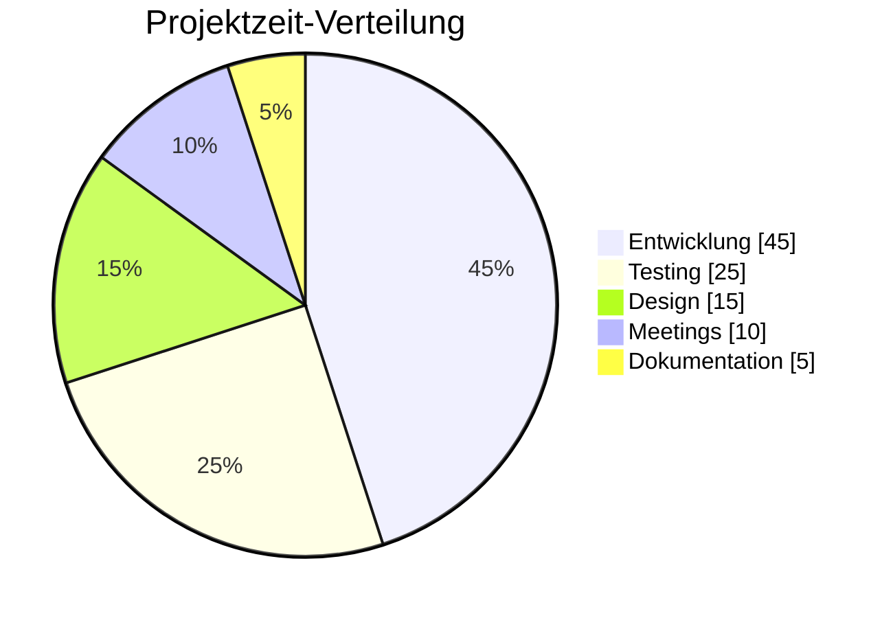
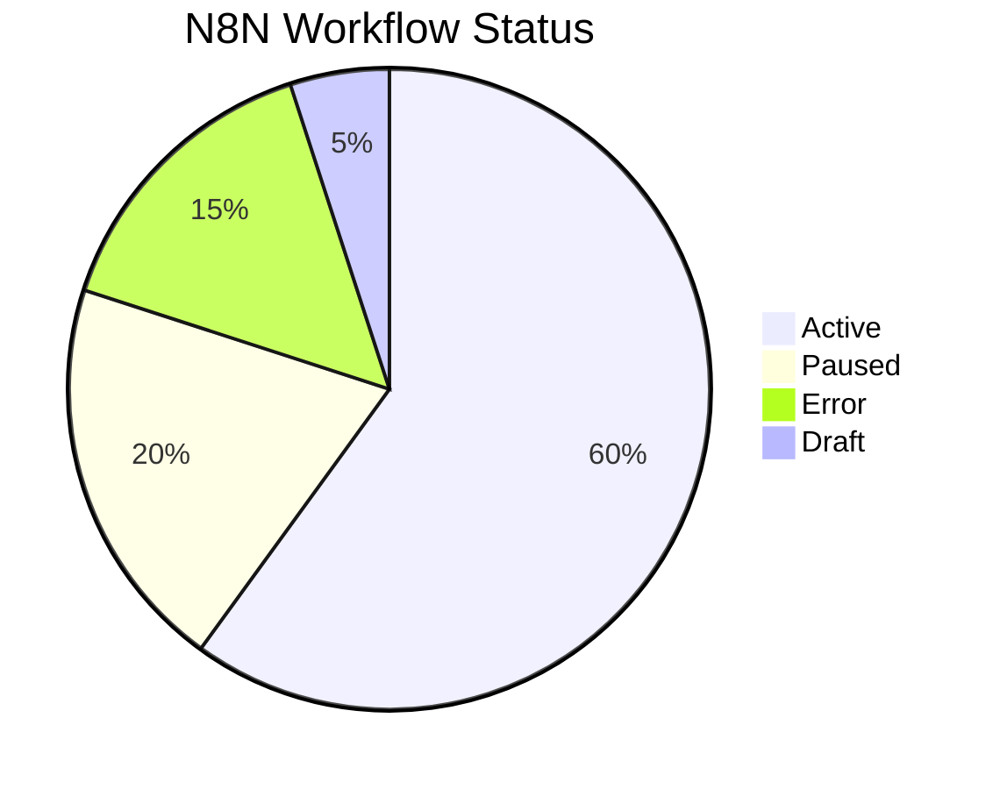
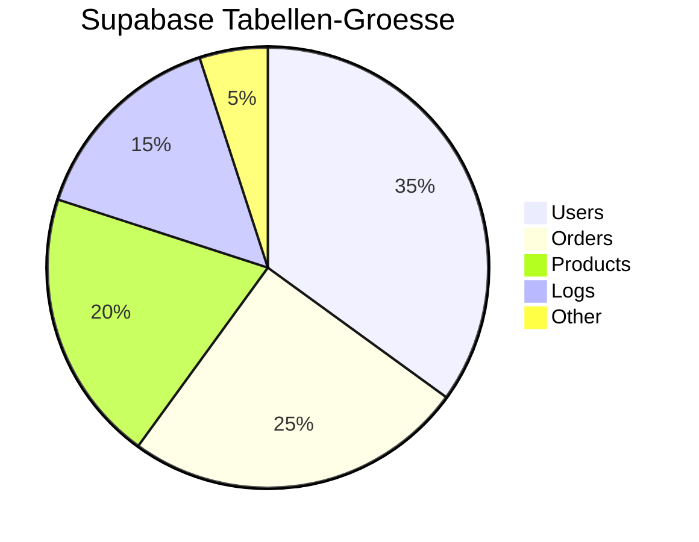
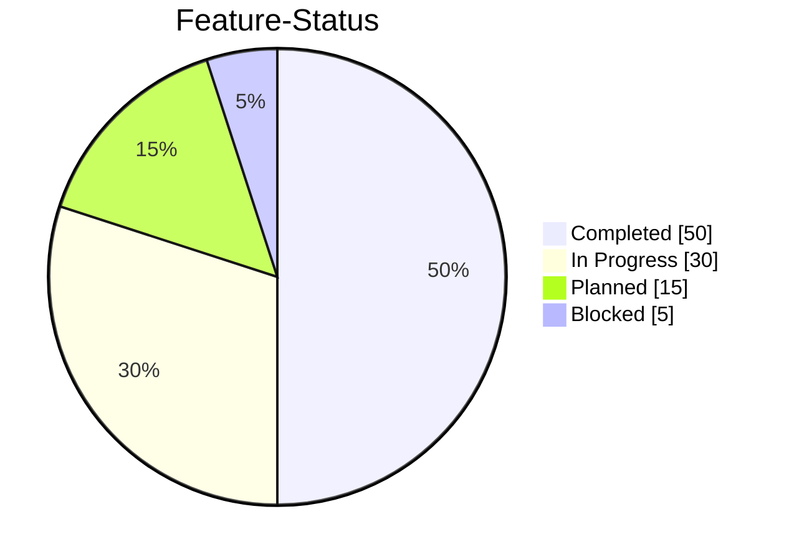

# Mermaid Pie Chart Skill

Spezialisierter Skill fuer Mermaid Pie-Diagramme. Pie Charts visualisieren Datenverteilungen und Anteile.

## Grundlagen

### Basis-Syntax

## Einfaches Pie Chart

### Standard-Format

### Mit showData

## Clevermation Templates

### Projektzeit-Verteilung

### Workflow-Status Verteilung

### Datenbank-Tabellen Groesse

### Feature-Verteilung

## Best Practices

### 1. Sinnvolle Kategorien
- Maximal 5-7 Kategorien
- Klare, aussagekraeftige Namen
- Logische Gruppierung

### 2. Daten-Konsistenz
- Werte sollten sinnvoll sein
- Prozentangaben sollten 100% ergeben (optional)
- Absolute Zahlen sind auch moeglich

### 3. Lesbarkeit
- `showData` fuer genaue Werte
- Titel immer angeben
- Kategorien kurz halten

### 4. Verwendung
- Fuer Anteils-Visualisierungen
- Nicht fuer Zeitreihen
- Nicht fuer Vergleiche zwischen Kategorien

## Verwendung im Plan Agent

Wenn der Plan Agent ein Pie Chart erstellen soll:
1. Identifiziere die Kategorien
2. Sammle die Daten/Werte
3. Definiere einen aussagekraeftigen Titel
4. Entscheide ob `showData` benoetigt wird
5. Erstelle das Diagramm mit diesem Skill

**Wichtig:** Nutze diesen Skill NUR fuer Pie Charts. Fuer andere Diagrammtypen verwende die entsprechenden Skills (flowchart, sequence, er, etc.).

