# Mermaid Sequence Diagram Skill

Spezialisierter Skill fuer Mermaid Sequence-Diagramme. Sequence Diagrams zeigen zeitliche Ablaeufe von Nachrichten zwischen Teilnehmern.

## Grundlagen

### Basis-Syntax
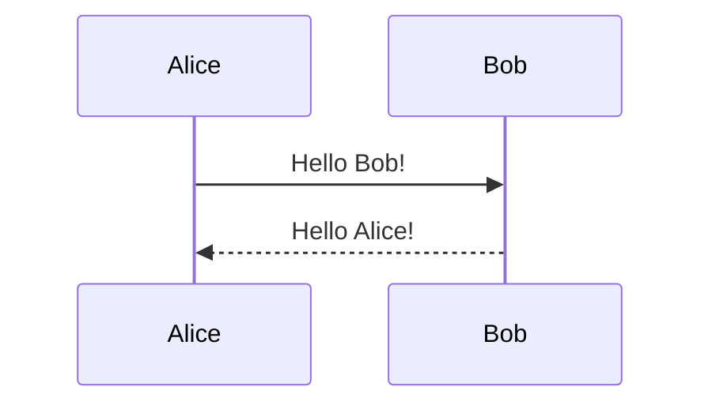
```mermaid
sequenceDiagram
    participant A as Alice
    participant B as Bob
    
    A->>B: Hello Bob!
    B-->>A: Hello Alice!
```

## Teilnehmer (Participants)

### Standard-Definition
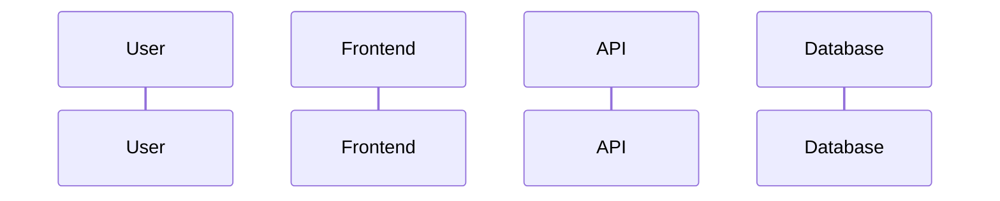
```mermaid
sequenceDiagram
    participant User
    participant Frontend
    participant API
    participant Database
```

### Mit Alias

```mermaid
sequenceDiagram
    participant U as User
    participant F as Frontend
    participant A as API
    participant D as Database
```

### Automatische Nummerierung
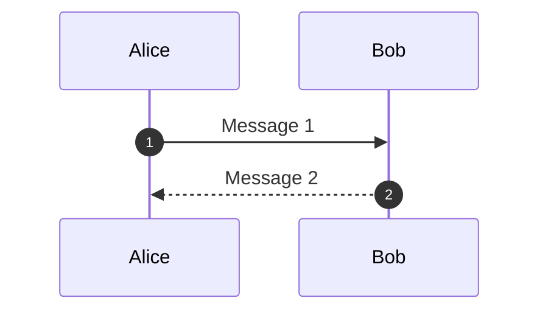
```mermaid
sequenceDiagram
    autonumber
    participant A as Alice
    participant B as Bob
    
    A->>B: Message 1
    B-->>A: Message 2
```

## Nachrichten-Typen

### Pfeil-Typen
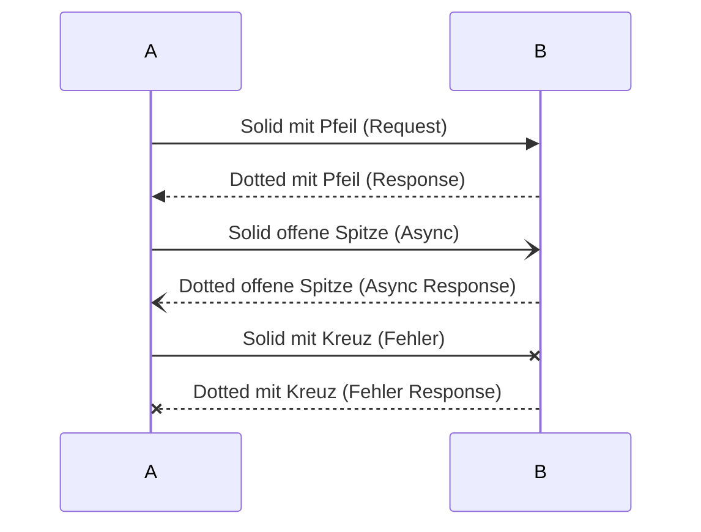
```mermaid
sequenceDiagram
    participant A
    participant B
    
    A->>B: Solid mit Pfeil (Request)
    B-->>A: Dotted mit Pfeil (Response)
    A-)B: Solid offene Spitze (Async)
    B--)A: Dotted offene Spitze (Async Response)
    A-xB: Solid mit Kreuz (Fehler)
    B--xA: Dotted mit Kreuz (Fehler Response)
```

### Nachrichten-Referenz
- `->>` - Solid mit Pfeil (synchrone Nachricht)
- `-->>` - Dotted mit Pfeil (Rueckmeldung)
- `-)` - Solid mit offener Spitze (asynchron)
- `--)` - Dotted mit offener Spitze (asynchrone Rueckmeldung)
- `-x` - Solid mit Kreuz (Fehler)
- `--x` - Dotted mit Kreuz (Fehler-Rueckmeldung)

## Aktivierungs-Boxen

### Aktivierung zeigen
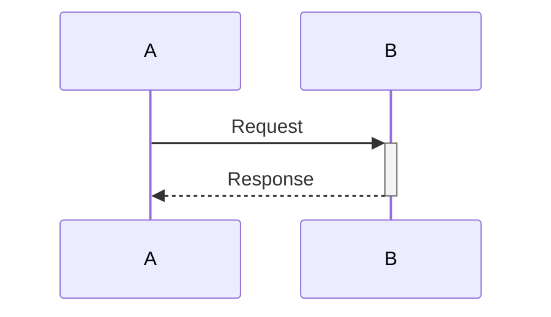
```mermaid
sequenceDiagram
    participant A
    participant B
    
    A->>+B: Request
    B-->>-A: Response
```

- `+` - Aktivierung starten
- `-` - Aktivierung beenden

### Verschachtelte Aktivierungen
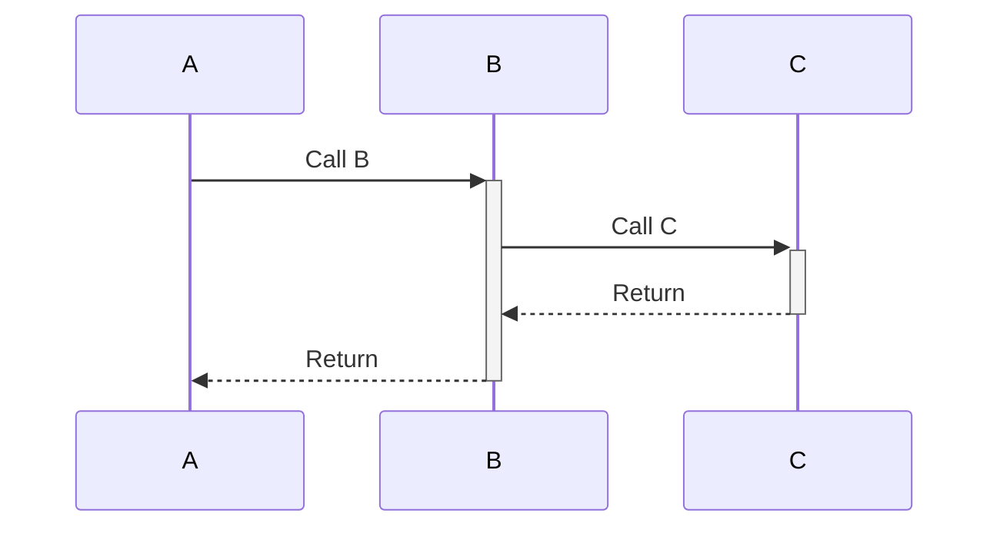
```mermaid
sequenceDiagram
    participant A
    participant B
    participant C
    
    A->>+B: Call B
    B->>+C: Call C
    C-->>-B: Return
    B-->>-A: Return
```

## Kontrollstrukturen

### Alt/Else (Alternative)
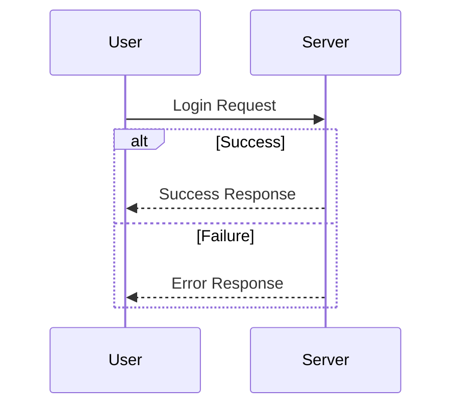
```mermaid
sequenceDiagram
    participant U as User
    participant S as Server
    
    U->>S: Login Request
    alt Success
        S-->>U: Success Response
    else Failure
        S-->>U: Error Response
    end
```

### Loop (Schleife)
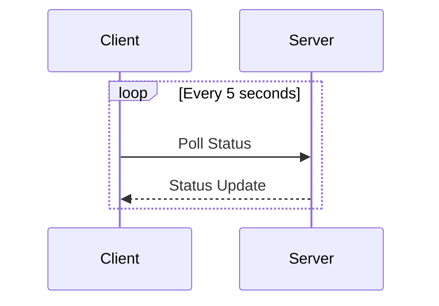
```mermaid
sequenceDiagram
    participant C as Client
    participant S as Server
    
    loop Every 5 seconds
        C->>S: Poll Status
        S-->>C: Status Update
    end
```

### Opt (Optional)
```mermaid
sequenceDiagram
    participant U as User
    participant S as Server
    
    U->>S: Request
    opt If Cached
        S-->>U: Cached Response
    else
        S->>S: Process Request
        S-->>U: Fresh Response
    end
```

### Par (Parallel)
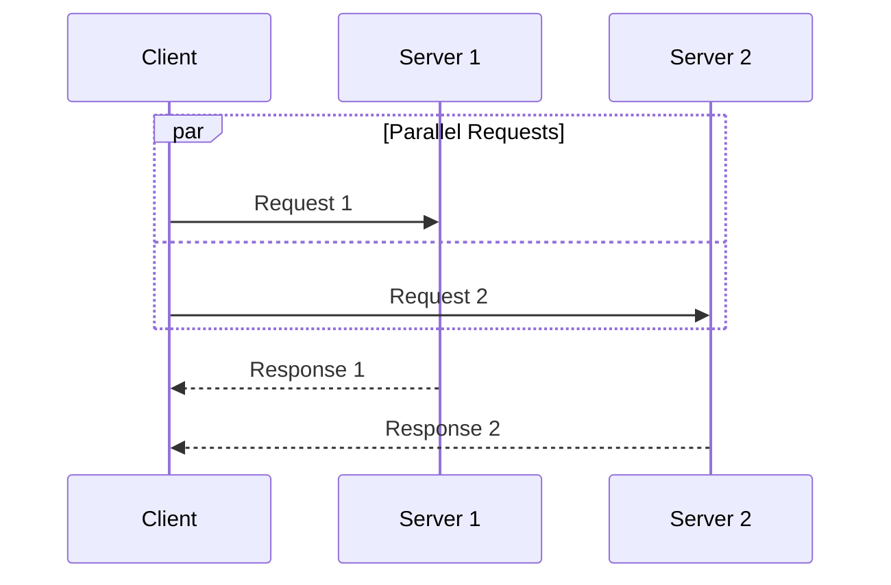
```mermaid
sequenceDiagram
    participant C as Client
    participant S1 as Server 1
    participant S2 as Server 2
    
    par Parallel Requests
        C->>S1: Request 1
    and
        C->>S2: Request 2
    end
    S1-->>C: Response 1
    S2-->>C: Response 2
```

### Break (Abbruch)
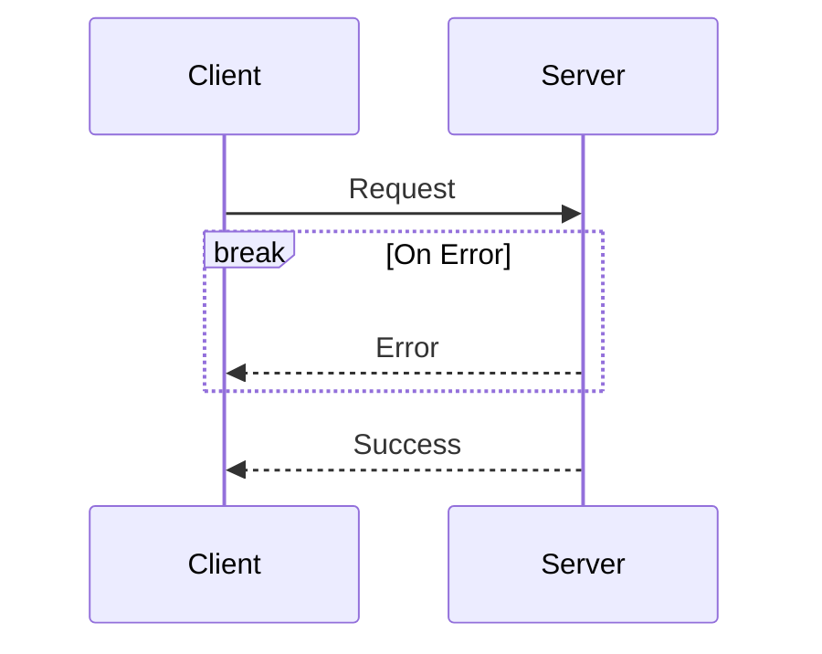
```mermaid
sequenceDiagram
    participant C as Client
    participant S as Server
    
    C->>S: Request
    break On Error
        S-->>C: Error
    end
    S-->>C: Success
```

### Critical (Kritischer Bereich)
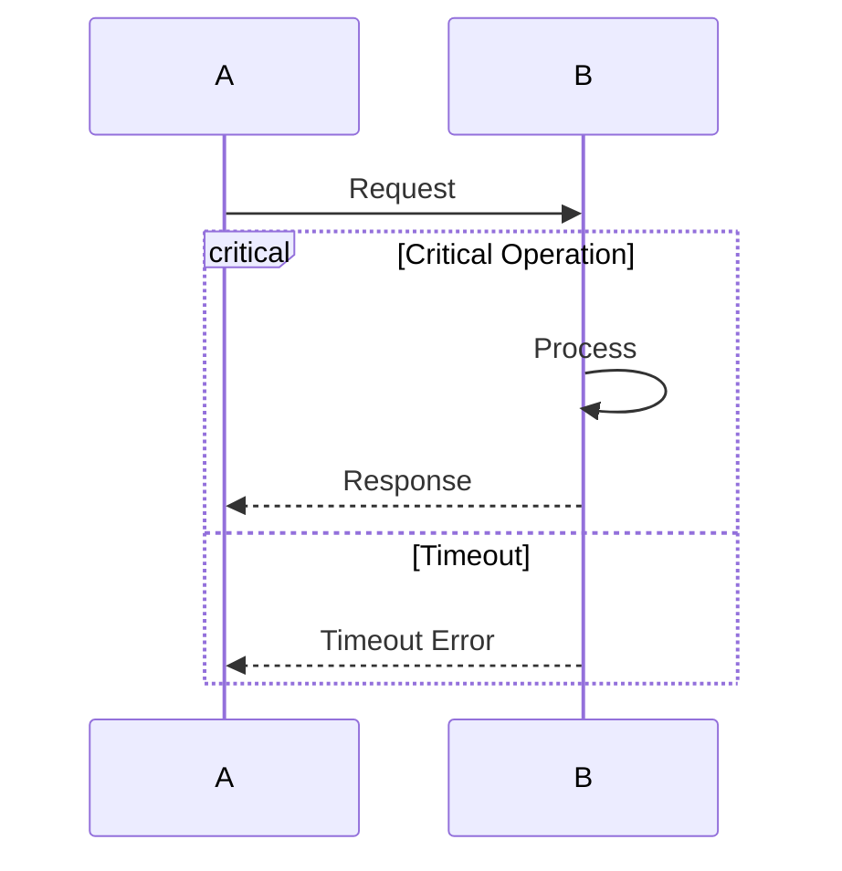
```mermaid
sequenceDiagram
    participant A
    participant B
    
    A->>B: Request
    critical Critical Operation
        B->>B: Process
        B-->>A: Response
    option Timeout
        B-->>A: Timeout Error
    end
```

## Notes (Notizen)

### Einfache Note
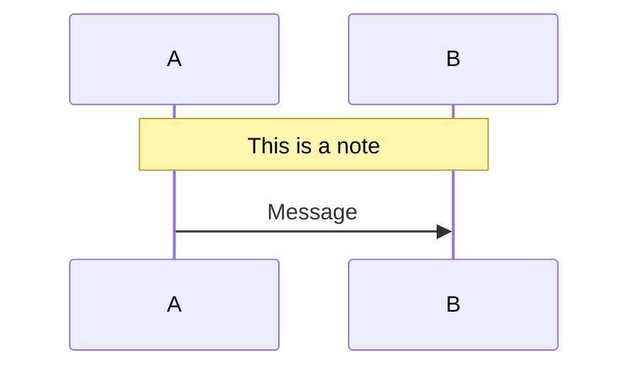
```mermaid
sequenceDiagram
    participant A
    participant B
    
    Note over A,B: This is a note
    A->>B: Message
```

### Note ueber einen Teilnehmer
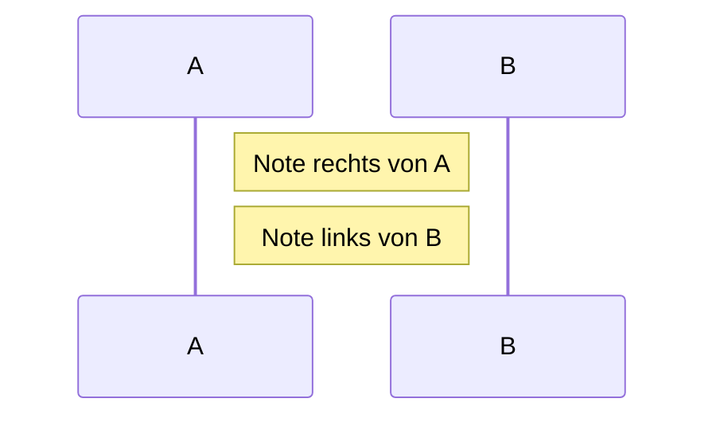
```mermaid
sequenceDiagram
    participant A
    participant B
    
    Note right of A: Note rechts von A
    Note left of B: Note links von B
```

### Note zwischen Teilnehmern
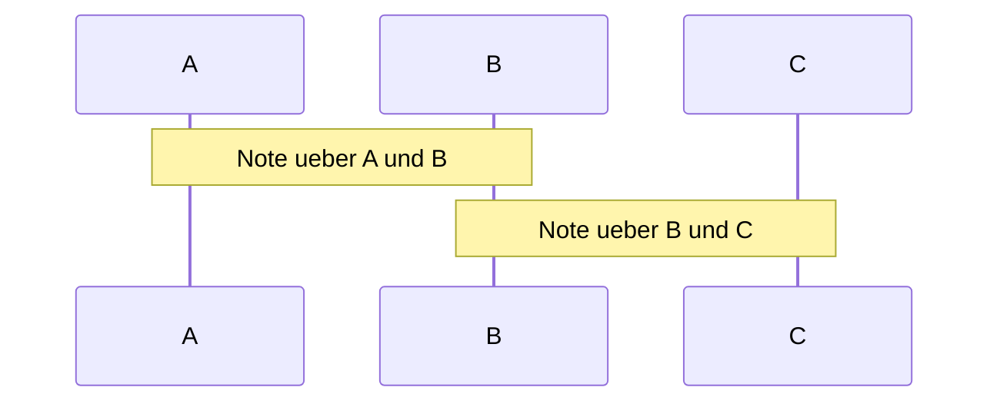
```mermaid
sequenceDiagram
    participant A
    participant B
    participant C
    
    Note over A,B: Note ueber A und B
    Note over B,C: Note ueber B und C
```

## Clevermation Templates

### Supabase Auth Flow
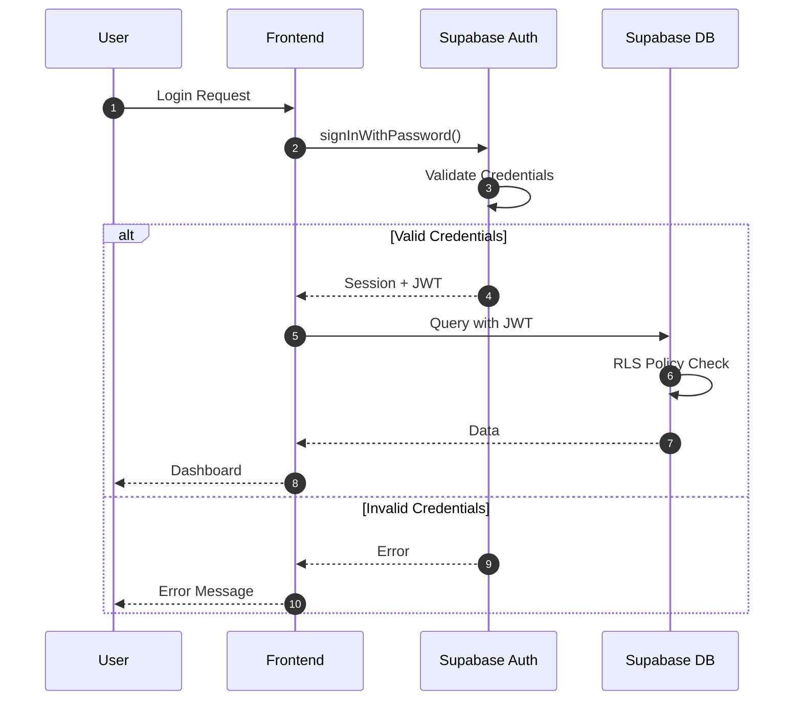
```mermaid
sequenceDiagram
    autonumber
    participant U as User
    participant F as Frontend
    participant A as Supabase Auth
    participant D as Supabase DB
    
    U->>F: Login Request
    F->>A: signInWithPassword()
    A->>A: Validate Credentials
    
    alt Valid Credentials
        A-->>F: Session + JWT
        F->>D: Query with JWT
        D->>D: RLS Policy Check
        D-->>F: Data
        F-->>U: Dashboard
    else Invalid Credentials
        A-->>F: Error
        F-->>U: Error Message
    end
```

### N8N Webhook Flow
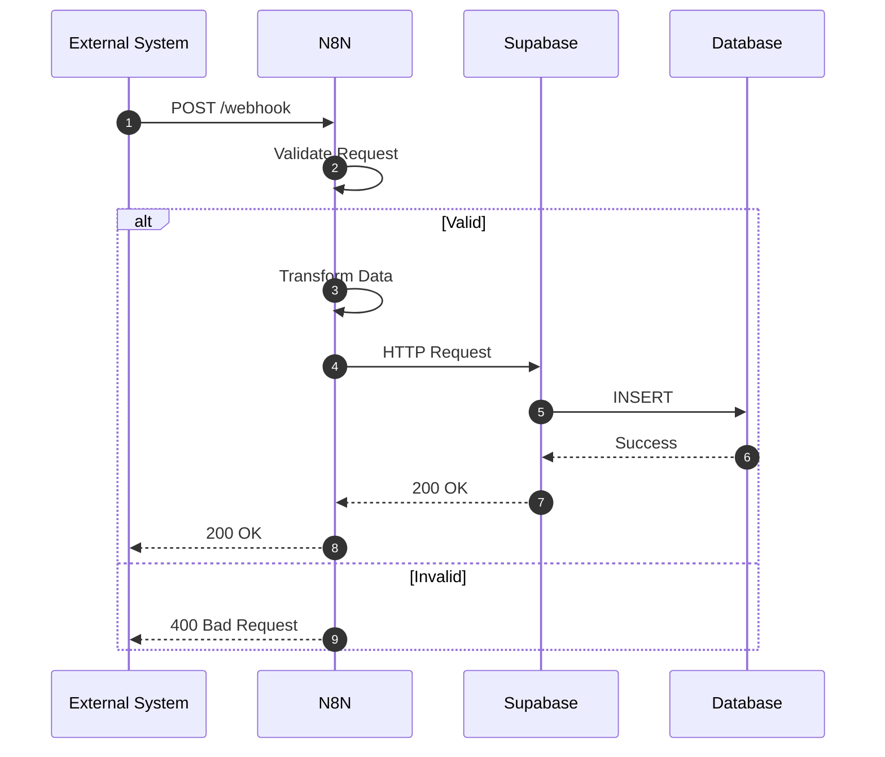
```mermaid
sequenceDiagram
    autonumber
    participant E as External System
    participant N as N8N
    participant S as Supabase
    participant D as Database
    
    E->>N: POST /webhook
    N->>N: Validate Request
    alt Valid
        N->>N: Transform Data
        N->>S: HTTP Request
        S->>D: INSERT
        D-->>S: Success
        S-->>N: 200 OK
        N-->>E: 200 OK
    else Invalid
        N-->>E: 400 Bad Request
    end
```

### API Request Flow mit Caching
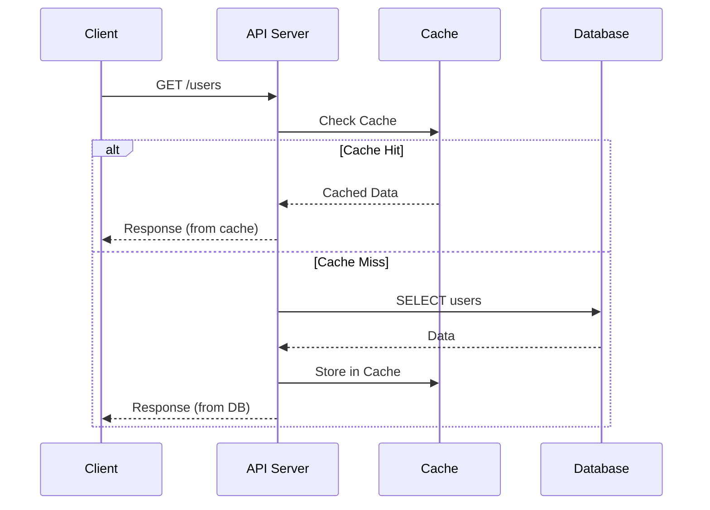
```mermaid
sequenceDiagram
    participant C as Client
    participant API as API Server
    participant Cache as Cache
    participant DB as Database
    
    C->>API: GET /users
    API->>Cache: Check Cache
    
    alt Cache Hit
        Cache-->>API: Cached Data
        API-->>C: Response (from cache)
    else Cache Miss
        API->>DB: SELECT users
        DB-->>API: Data
        API->>Cache: Store in Cache
        API-->>C: Response (from DB)
    end
```

### Multi-Step Form Submission
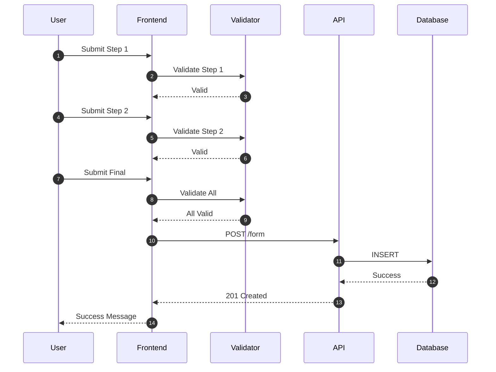
```mermaid
sequenceDiagram
    autonumber
    participant U as User
    participant F as Frontend
    participant V as Validator
    participant API as API
    participant DB as Database
    
    U->>F: Submit Step 1
    F->>V: Validate Step 1
    V-->>F: Valid
    
    U->>F: Submit Step 2
    F->>V: Validate Step 2
    V-->>F: Valid
    
    U->>F: Submit Final
    F->>V: Validate All
    V-->>F: All Valid
    F->>API: POST /form
    API->>DB: INSERT
    DB-->>API: Success
    API-->>F: 201 Created
    F-->>U: Success Message
```

## Best Practices

### 1. Klare Teilnehmer-Namen
- Verwende aussagekraeftige Namen
- Nutze Aliases fuer lange Namen
- Gruppiere verwandte Teilnehmer

### 2. Logische Reihenfolge
- Wichtige Teilnehmer links
- Zeitliche Ablaeufe von oben nach unten
- Verwandte Nachrichten gruppieren

### 3. Aktivierung-Boxen sparsam
- Nur bei wichtigen Operationen
- Nicht bei jeder Nachricht
- Zeigt Lebensdauer von Operationen

### 4. Kontrollstrukturen richtig nutzen
- `alt/else` fuer Alternativen
- `loop` fuer Wiederholungen
- `opt` fuer optionale Schritte
- `par` fuer parallele Ablaeufe

## Verwendung im Plan Agent

Wenn der Plan Agent ein Sequence Diagram erstellen soll:
1. Identifiziere alle Teilnehmer (Systeme, Services, User)
2. Definiere die Nachrichten-Flows
3. Markiere Alternativen und Loops
4. Verwende Aktivierungs-Boxen fuer wichtige Operationen
5. Erstelle das Diagramm mit diesem Skill

**Wichtig:** Nutze diesen Skill NUR fuer Sequence Diagrams. Fuer andere Diagrammtypen verwende die entsprechenden Skills (flowchart, er, gantt, etc.).

