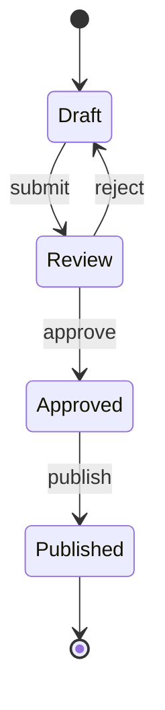
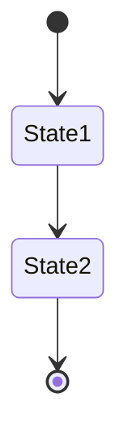
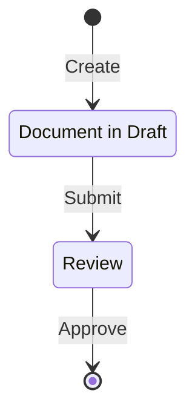
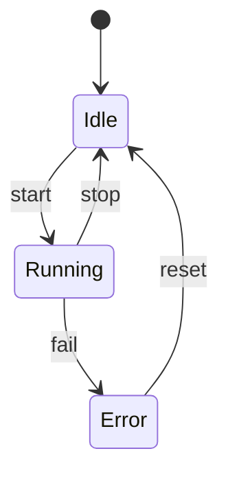
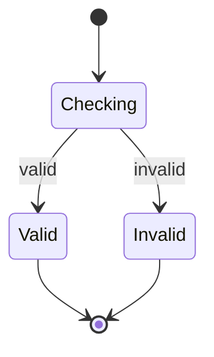
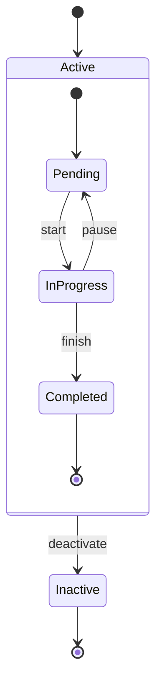
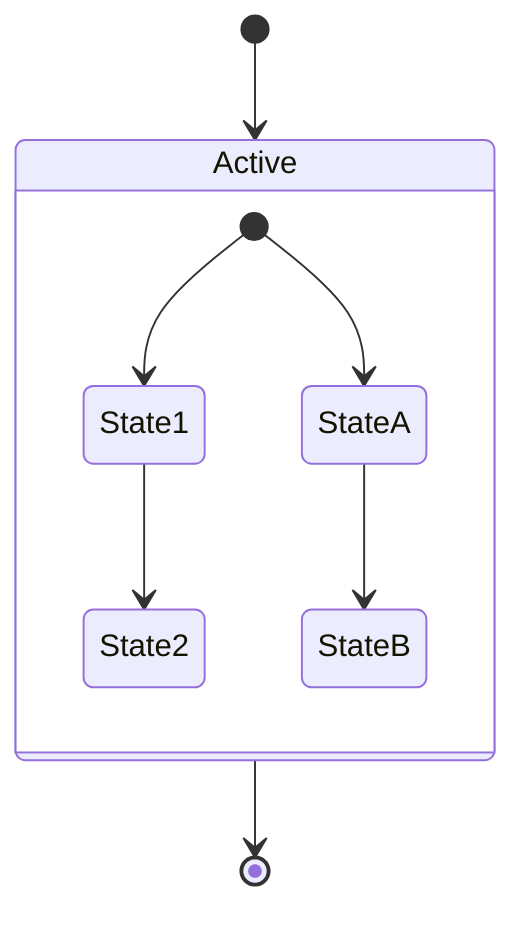
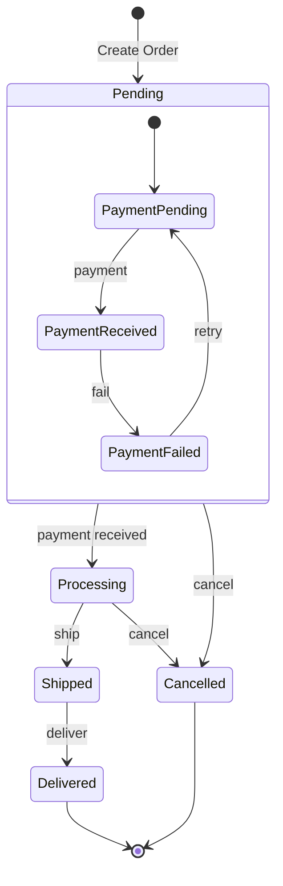
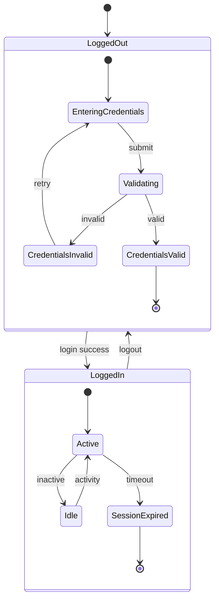
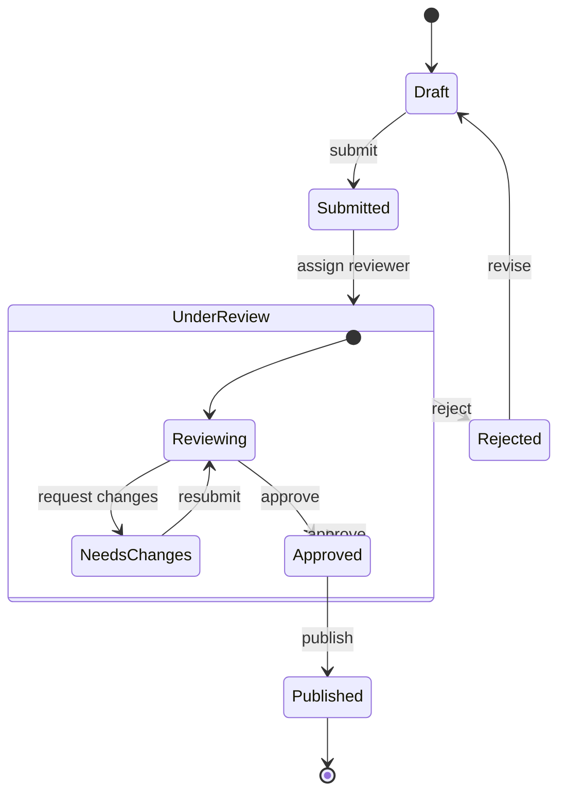

# Mermaid State Diagram Skill

Spezialisierter Skill fuer Mermaid State-Diagramme. State Diagrams visualisieren Zustandsmaschinen und Zustandsuebergaenge.

## Grundlagen

### Basis-Syntax

## States (Zustaende)

### Einfache States

### States mit Beschreibung

## Transitions (Uebergaenge)

### Transition mit Label

### Transition mit Bedingung

## Nested States (Verschachtelte States)

### Composite States

### Parallel States

## Clevermation Templates

### Order Status Flow

### User Authentication Flow

### Workflow Approval Process

## Best Practices

### 1. Klare State-Namen
- Aussagekraeftige Namen verwenden
- States als Substantive (Draft, Review, Approved)
- Transitions als Verben (submit, approve, reject)

### 2. Logische Struktur
- Start-State: `[*]`
- End-State: `[*]`
- Verschachtelte States fuer komplexe Logik

### 3. Transition-Labels
- Immer Labels bei Transitions
- Klare Bedingungen/Events
- Konsistente Namensgebung

### 4. Komplexitaet managen
- Bei vielen States: Verschachteln
- Wichtige States hervorheben
- Unwichtige Details weglassen

## Verwendung im Plan Agent

Wenn der Plan Agent ein State Diagram erstellen soll:
1. Identifiziere alle moeglichen Zustaende
2. Definiere Start- und End-Zustaende
3. Bestimme alle moeglichen Uebergaenge
4. Markiere Bedingungen/Events fuer Uebergaenge
5. Verwende verschachtelte States bei Komplexitaet
6. Erstelle das Diagramm mit diesem Skill

**Wichtig:** Nutze diesen Skill NUR fuer State Diagrams. Fuer andere Diagrammtypen verwende die entsprechenden Skills (flowchart, sequence, er, etc.).

